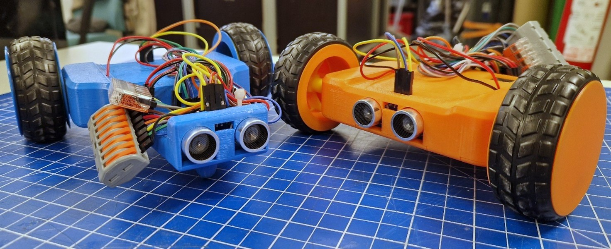
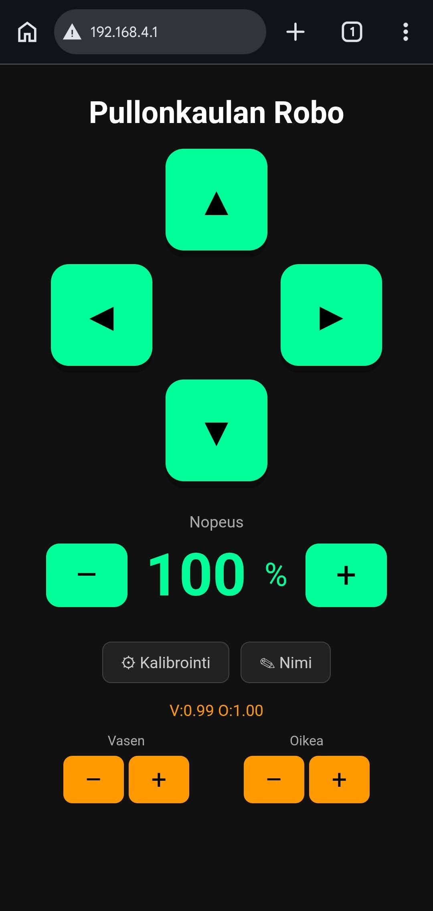

<div align="center">

# 🤖 Rakenna oma mobiilirobotti 🤖



**Rakenna oma WiFi-ohjattava mobiilirobotti törmäyksenestolla alusta loppuun!**

[](https://youtu.be/AeR3-ane96E)


*Pullonkaula ry*

</div>

---

## 📖 Tietoa projektista

Rakenna oma mobiilirobotti! Tämä projekti on alun pitäen saanut alkunsa Tampereen kaupungin Masseista mahiksia -tapahtumana syksyllä 2026. Tapahtumassa yläkoululaiset pääsivät rakentamaan oman mobiilirobotin, jota ohjataan älypuhelimella WiFin välityksellä. Robotti sisältää myös yksinkertaisen törmäyksenestojärjestelmän ultraääniantureiden avulla. Robotin kasausprosessi opettaa käytännön läheisesti sulautettujen järjestelmien toiminnan eli sen miten anturit ja toimilaitteet toimivat yhdessä!

Tapahtuma sopii erinomaisesti kaikille – aiempaa kokemusta ei vaadita. 💡

📄 Kaikki projektin tiedostot, mukaan lukien tämä repo, löytyvät osoitteesta [github.com/aapokek/Rakenna-oma-mobiilirobotti](https://github.com/aapokek/Rakenna-oma-mobiilirobotti)

---

## ✨ Ominaisuudet

- 📱 **WiFi-ohjaus** älypuhelimella selaimen kautta
- 🚧 **Törmäyksenesto** edessä ja takana
- 🖨️ **3D-tulostettu runko**
- ⚡ **AA-paristoilla** toimiva
- 🔧 **Helppo koota**
- 💰 **Kustannustehokas** – noin 20 € / kpl

---

## 🧰 Komponentit

| Komponentti | Määrä | Tehtävä |
|---|---|---|
| ESP8266 D1 mini | 1 | Mikrokontrolleri – robotin "aivot" |
| MP1584EN | 1 | Jännitteenmuuntaja (6V → 3.3V) |
| L298N mini + 470 µF | 1 | Moottorinohjain |
| HC-SR04 | 2 | Ultraäänianturit törmäyksenestoon |
| TT-moottori (1:48) | 2 | Liike |
| Rengas | 2 | Liike |
| 4×AA paristokotelo | 1 | Virtalähde |
| AA paristo (1.5 V) | 4 | Virtalähde |
| Vipuliittimet (3-, 5-, 8-napainen) | 1 kpl/tyyppi | Johdotus ilman juottamista |
| 0-0 hyppykaapelit | 8 | Kommunikaatiojohdot |
| 0-1 hyppykaapelit | 12 | Virtajohdot |
| M2×6 mm ruuvi | 3 | Rungon kiinnitys |
| Nippuside | 2 | Johtojen siistiminen |

> **Työkalut:** Tietokone, USB-C-kaapeli, ristipääruuvimeisseli, sivuleikkurit tai sakset

---

## 📁 Projektin rakenne

```
📦 Rakenna oma mobiilirobotti
├── 📂 3D-mallit
│   ├── 📂 Solidworks          ← Alkuperäiset SolidWorks-tiedostot
│   │   ├── Komponentit
│   │   └── Tulostettavat osat
│   ├── 📂 STEP                ← Universaali 3D-formaatti
│   └── 📂 STL                 ← Suoraan 3D-tulostimeen/Sliceriin!
├── 📂 Dokumentaatio
│   └── Kasausohje (.pdf & .docx)   ← Täysi, yksityiskohtainen ohje
├── 📂 Koodit
│   └── Mobiilirobotin_koodi
│       └── Mobiilirobotin_koodi.ino   ← Arduino-koodi ESP8266:lle
└── 📂 Kuvia
    ├── Mobiilirobotin kytkentäkaavio.png
    ├── Mobiilirobotit.jpg
    ├── Kayttoliittyma.jpg
    └── Pullonkaula.jpg
```

---

## 🚀 Pikaopas kasaukseen

> 📄 Löydät täyden, yksityiskohtaisen ohjeen hakemistosta [`Dokumentaatio/`](Dokumentaatio/)  
> 🎬 Tai katso kasausvideo: [youtu.be/AeR3-ane96E](https://youtu.be/AeR3-ane96E)

### 1️⃣ Koodin asennus

<details>
<summary><b>Asenna Arduino IDE</b></summary>

1. Mene osoitteeseen [arduino.cc/en/software](https://www.arduino.cc/en/software)
2. Lataa **Arduino IDE** omalle käyttöjärjestelmällesi (Windows / macOS / Linux)
3. Asenna ohjelma normaalisti asennusvelhon ohjeiden mukaan
4. Käynnistä Arduino IDE

</details>

<details>
<summary><b>Asenna ESP8266-tuki Arduino IDE:hen</b></summary>

1. Avaa Arduino IDE ja mene **File → Preferences**
2. Lisää **Additional boards manager URLs** -kenttään:
   ```
   https://arduino.esp8266.com/stable/package_esp8266com_index.json
   ```
3. Mene **Tools → Board → Boards Manager**, hae `esp8266` ja asenna **ESP8266 by ESP8266 Community**
4. Valitse piiriksi **Tools → Board → ESP8266 Boards → LOLIN(WEMOS) D1 mini (clone)**

</details>

<details>
<summary><b>Asenna tarvittavat kirjastot</b></summary>

Seuraavat kirjastot täytyy asentaa ennen koodin lataamista. Kirjastot löytyvät Arduino IDE:n kirjastonhallinnasta (**Tools → Manage Libraries…**) tai GitHub-linkeistä.

| Kirjasto | Asennus |
|---|---|
| `ESP8266WiFi` | Tulee automaattisesti ESP8266-tuen mukana |
| `DNSServer` | Tulee automaattisesti ESP8266-tuen mukana |
| `LittleFS` | Tulee automaattisesti ESP8266-tuen mukana |
| `ESPAsyncTCP` | Hae nimellä **ESPAsyncTCP** kirjastonhallinnasta |
| `ESPAsyncWebServer` | Hae nimellä **ESPAsyncWebServer** kirjastonhallinnasta |

> ⚠️ Jos `ESPAsyncTCP` tai `ESPAsyncWebServer` eivät löydy kirjastonhallinnasta, asenna ne manuaalisesti GitHubista:
> - [ESPAsyncTCP](https://github.com/me-no-dev/ESPAsyncTCP) → Code → Download ZIP → **Sketch → Include Library → Add .ZIP Library**
> - [ESPAsyncWebServer](https://github.com/me-no-dev/ESPAsyncWebServer) → sama menettely

</details>

Avaa `Koodit/Mobiilirobotin_koodi/Mobiilirobotin_koodi.ino` Arduino IDE:ssä. Muokkaa **riveille 2 ja 3** robotille haluamasi WiFi-verkon nimi ja salasana:

```cpp
String robotName = "MunRobotti";
static const char* AP_PASSWORD = "OmaSalasana"; // 8–63 merkkiä
```

Yhdistä ESP8266 D1 mini USB-C-kaapelilla tietokoneeseen ja paina Arduino IDE:ssä vasemman yläkulman **→ (Upload)**. Koodi on latautunut onnistuneesti, kun näet ilmoituksen `Done uploading`.

### 2️⃣ Komponenttien asennus runkoon

Tulosta ensin 3D-tulostettavat osat `3D-mallit/STL/`-kansiosta: ylärunko, alarunko, paristopidike sekä renkaiden pöly- ja sisäkapselit (2 kpl kumpaakin).

Työnnä moottoreiden johdot ylärungon sivureikien läpi ja paina moottorit paikoilleen. Paina sitten ESP8266 D1 mini, MP1584EN, L298N mini sekä molemmat HC-SR04-anturit niille tulostettuihin loviin. Asenna lopuksi AA-paristot paristokoteloon (kytkin OFF-asennossa!) ja kiinnitä paristopidike paikoilleen. Asenna alarunko pohjaksi, mutta jätä ruuvit vielä kiinnittämättä.

### 3️⃣ Virtajohtojen kytkeminen

Kytke robotin 18 virtajohtoa (12 toteutetaan 0-1 hyppykaapeleilla) kytkentäkaavion mukaisesti: kaikki maajohdot (GND) suurimpaan 8-napaiseen vipuliittimeen, paristoilta tuleva 6 V 3-napaiseen liittimeen ja MP1584EN:n antama 3.3 V 5-napaiseen liittimeen. Kytke myös moottorien johdot L298N minin MOTOR-A ja MOTOR-B -pinneihin.

### 4️⃣ Kommunikaatiojohtojen kytkeminen

Kytke 8 kommunikaatiojohtoa 0-0 hyppykaapeleilla ESP8266 D1 miniin kytkentäkaavion mukaisesti. Katso kytkentäkaavio alta! ⬇️

### 5️⃣ Testaus

> ⚠️ **Tarkastuta kytkennät huolella ennen testauksen aloittamista!**

Kiinnitä renkaat paikoilleen ja käynnistä robotti paristokotelon kytkimestä. Yhdistä puhelimella robotin WiFi-verkkoon ja avaa selaimessa `192.168.4.1` (jos ohjausnäkymä ei avaudu automaattisesti). Näytöllesi pitäisi ilmestyä alla näkyvä ohjausnäkymä.

<div align="center">

</div>

Ohjaa robottia napeista – jos jompikumpi moottori pyörii väärään suuntaan, vaihda sen virtajohdot päikseen.

### 6️⃣ Viimeistely

Ruuvaa pohja kiinni kolmella M2-ruuvilla ja siisti johdot kahdella nippusiteellä. Voit halutessasi kalibroida robotin kulkemaan suoraan sekä nimetä sen uudelleen käyttöliittymän valikoista.

---

## 🔌 Kytkentäkaavio

<details>
<summary><b>Näytä kytkentäkaavio</b></summary>


**Pääperiaate:**
- 🔴 **6 V** (paristot) → L298N mini ja MP1584EN sisääntulo
- 🟠 **3.3 V** (MP1584EN ulostulo) → ESP8266 D1 mini ja HC-SR04-anturit
- ⚫ **GND** → kaikki komponentit yhteiseen 8-napaiseen vipuliittimeen

**Kommunikaatiojohdot (ESP8266):**

| L298N / HC-SR04 | ESP8266-pinni |
|---|---|
| IN1 | D1 |
| IN2 | D2 |
| IN3 | D6 |
| IN4 | D5 |
| Etuanturi Trig | D7 |
| Etuanturi Echo | D8 |
| Takaanturi Trig | D0 |
| Takaanturi Echo | D3 |

</details>

---

## 🎬 Kasausvideo

[](https://youtu.be/AeR3-ane96E)

---

## 📜 Lisenssi

Tämä projekti on kehitetty opetuksellisiin tarkoituksiin ja sen kaupallinen käyttö on kielletty.
Kehittäjä: **Aapo Kekkonen**